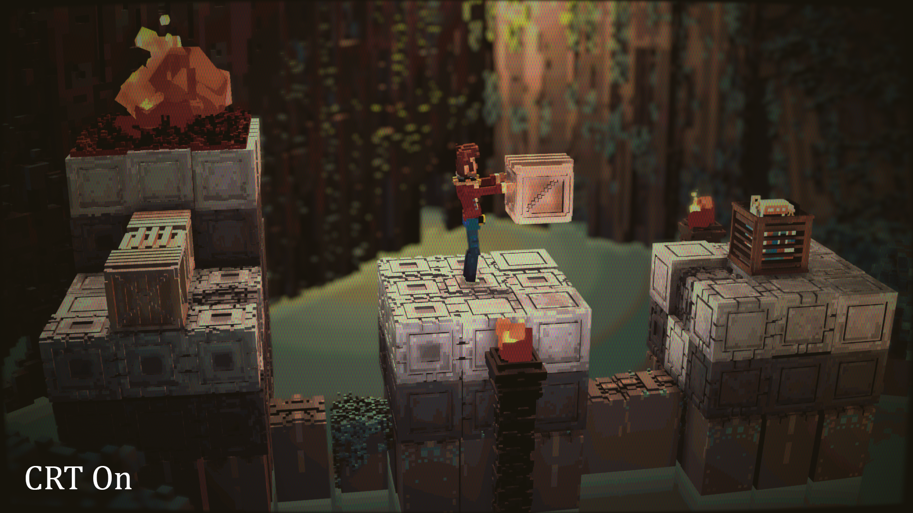
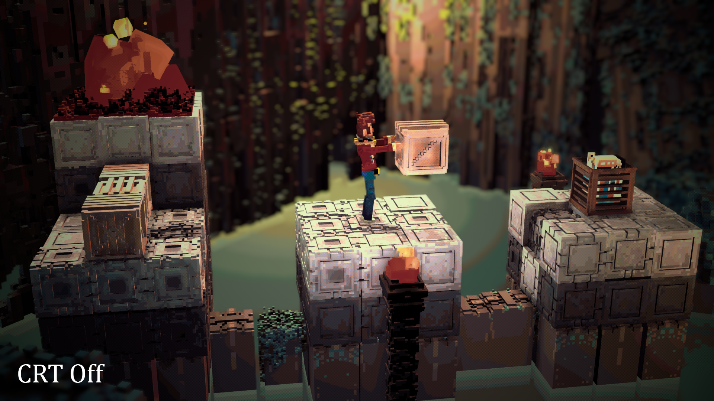

# KonodFX

This is a collection of shaders for ReShade, a post-processing injector for video games. Those shaders are written in FX, ReShade's personal shading language. For more informations, check [ReShade's website](https://reshade.me/).

## Installation

You will need to download and extract the `Shaders` folder.
Install [ReShade](https://reshade.me/) and follows the instructions. Choose the game you'd like to alter. Make sure that the game you choose does not blacklist ReShade! It may happens for online/competitive games as an anti-cheat measure.
When asked to select the effect packages to install, DO NOT press on skip, as you will need the `Standard effects` package (my shaders include `Reshade.fxh`). You can select any other package you like, but this one is mandatory for the installation anyway.

Once done, you can merge this repository's `Shaders` folder with ReShade's one: `-game.exe's folder\reshade-shaders\Shaders`.

You can also launch the game, go in the ReShade window and in the `Settings` tab. There, you can add the path to the `Shaders` folder in the `Effect Search Paths` command. Then, reload the shaders.

Finally, on the `Home` tab of the ReShade window, select a `.ini` file to save your shaders configurations (I recommand creating a new file) and you're ready! You can enable and disable any shaders, and play with the parameters.

If you want to uninstall ReShade on your game, run the installer, select your game (and the API) and then choose "Uninstall".

## Examples

#### Bloom:

A bloom shader using GPU downscaling for better performances.

#### Hexagonal CRT:

A CRT shader combining a curvature of the screen, a hexagonal aperture grid display and color mixing. All of these options can be disabled individually. 

